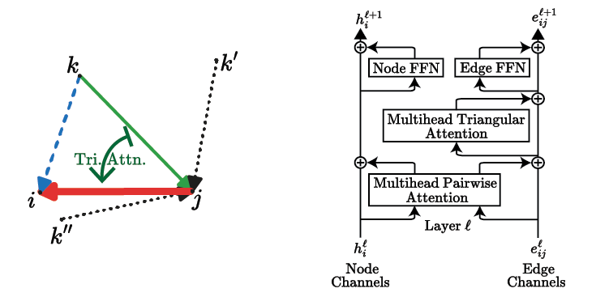

# Edge-augmented Graph Transformer with Triangular Attention



## Introduction

This is the official implementation of Triangular Attention which extends the **Edge-augmented Graph Transformer (EGT)** architecture as described in <https://arxiv.org/abs/2108.03348>, on the [OGB-LSC](https://ogb.stanford.edu/docs/lsc/) PCQM4Mv2 dataset. The code is based on the original implementation of EGT at <https://github.com/shamim-hussain/egt_pytorch>. 

Triangular attention extends the pairwise attention in EGT to allow for 2 pairs sharing a common node to interact with each other, which is found to be beneficial for molecular property prediction. We employ a two-stage model with the same architecture. The first stage produces an estimation of pair-wise distances between atoms, which is then used by the second stage to predict the HOMO-LUMO gap. The training is carried out in three stages - (i) training of the distance predictor, (ii) pretraining of the gap predictor with noisy coordinates and (iii) fine-tuning of the gap predictor with predicted distances. For more information see the [Technical Report](Report.pdf).

## Results

Model            | Use RDKIT Coords |Dist. Pred. #layers | Gap Pred. #layers | #params | Metric         | Valid           | Test           |
-----------------|------------------|--------------------|-------------------|---------|----------------|-----------------|----------------|
EGT + Tri. Attn. |:x:               |       24           |        24         | 204M    | MAE            | 68.6 meV        | 69.8 meV       |
EGT + Tri. Attn. |:white_check_mark:|       24           |        24         | 204M    | MAE            | 67.1 meV        | 68.3 meV       |

## Requirements

* `python >= 3.7`
* `pytorch >= 1.6.0`
* `numpy >= 1.18.4`
* `numba >= 0.50.1`
* `ogb >= 1.3.2`
* `rdkit>=2019.03.1`
* `yaml >= 5.3.1`
* `pyarrow >= 8.0.0`
* `nvidia-apex (recommended)`

# Downloading the Data
The preprocessed data is available at <https://huggingface.co/datasets/shamim-hussain/pcqm>. The `parquet` and `npz` files must be put in the `data/PCQM` directory. You can also download them by running the following command:
```
bash download_data.sh
```

## Run Training and Evaluations

You can specify the training/prediction/evaluation configurations by creating a `yaml` config file and also by passing a series of `yaml` readable arguments. (Any additional config passed as argument willl override the config specified in the file.)

* To run training: ```python run_training.py [config_file.yaml] ['config1: value1'] ['config2: value2'] ...```
* To make predictions: ```python make_predictions.py [config_file.yaml] ['config1: value1'] ['config2: value2'] ...```
* To perform evaluations: ```python do_evaluations.py [config_file.yaml] ['config1: value1'] ['config2: value2'] ...```

Config files for the results can be found in the configs directory. Examples:
```
python run_training.py configs/pcqm_finetune/egt_100m_rdkit.yaml
python run_training.py 'scheme: pcqm_dist_pred' 'model_height: 6'
python make_predictions.py configs/pcqm_dist_pred/egt_100m_rdkit.yaml 'predict_on: ["train", "val"]'
```

### More About Training

Once the training is started a model directory will be created in the *models* directory, under the specified training stage/scheme name. This directory will contain a copy of the input config file, for the convenience of resuming training/evaluation. Also, it will contain a config.yaml which will contain all configs, including unspecified default values, used for the training. Training will be checkpointed per epoch. In the case of any interruption, you can resume training by running the *run_training.py* with the config.yaml file again (you may also simply specify the directory containing config_input.yaml as a shorthand).

As mentioned before, the training is carried out in stages. Here is an example of the sets of commands for training and inference (with RDKIT coords) -

```
# Stage 1 - Train the distance predictor
python run_training.py configs/pcqm_dist_pred/egt_100m_rdkit.yaml

# Make distance predictions (on the training and validation sets by default)
python make_predictions.py configs/pcqm_dist_pred/egt_100m_rdkit.yaml

# this will create a 'predictions' directory (e.g. bins50) in the model directory, containing the predictions for the training and validation sets
# to reduce the number of distance samples (and thus save time and disk space)
# add the following argument 'prediction_samples: 10'
# (we used 50 samples, you can increase it during final inference to get better results),
# to predict on the test set add the following argument 'predict_on: ["test"]'


# Stage 2 - Pretrain the gap predictor with noisy coordinates
python run_training.py configs/pcqm_pretrain/egt_100m.yaml

# this will create a 'checkpoint' directory in the model directory
# the model_state file in the last checkpoint will be used for the next stage


# Stage 3 - Fine-tune the gap predictor with predicted distances
python run_training.py configs/pcqm_finetune/egt_100m_rdkit.yaml

# make sure that the 'bins_input_path' points to the correct distance predictions,
# e.g., 'models/pcqm_dist_pred/egt_100m_rdkit/predictions/bins50'
# and the 'pretrained_weights_file' points to the correct pretrained checkpoint,
# e.g., 'models/pcqm_pretrain/egt_100m/checkpoint/model_state'


# Stage 4 - Do final evaluation (and trim the model by removing the denoising head)
python run configs/pcqm_gap_pred/egt_100m_rdkit.yaml

# make sure the 'pretrained_weights_file' points to the correct checkpoint from the finetuning stage,
# e.g., 'models/pcqm_finetune/egt_100m_rdkit/checkpoint/model_state'
# this does not really do any training, but it will create a 'checkpoint' directory
# in the model directory, containing the final checkpoint, without the denoising head

# Final evaluation:
python do_evaluations.py configs/pcqm_gap_pred/egt_100m_rdkit.yaml

# the results will be printed to the console and also saved in the predictions directory
# in case of the test-dev split it will also create as submission file in the model directory
```

### TorchRun and Multi-Nodes Training

The basic Python scripts are capable of running on multiple GPUs on a single node (by internally spawning multiple processes). However, they support `torchrun` as well (detected via checking the environment set by `torchrun`). The `torchrun` method is more efficient in training on multiple nodes. An example training script for `slurm` is provided as `torchrun.sh`.

## Python Environment

The Anaconda environment in which the experiments were conducted is specified in the `environment.yml` file.

## Citation

Please cite the following paper if you find the code useful:
```
@article{hussain2021global,
  title={Global Self-Attention as a Replacement for Graph Convolution},
  author={Hussain, Md Shamim and Zaki, Mohammed J and Subramanian, Dharmashankar},
  journal={arXiv preprint arXiv:2108.03348},
  year={2021}
}
```
